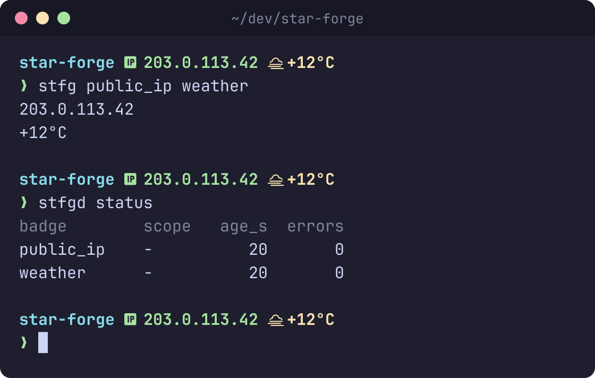

# star-forge


[](https://github.com/SkeLLLa/star-forge/actions/workflows/ci.yml)
[](https://github.com/SkeLLLa/star-forge/releases/latest)
[](https://crates.io/crates/star-forge)
[](Cargo.toml)
[](COPYING)

Fast, cached badges for your shell prompt and tmux status line.

[Starship](https://starship.rs) redraws your prompt from scratch every time. Its built-in
modules are quick, but a `[custom.*]` module (your public IP, the weather, CI status, a slow
CLI) runs again on every Enter. A 300 ms `curl` means a 300 ms pause before every prompt.

star-forge moves that work into a small background daemon that refreshes each value on its own
schedule. Your prompt reads the cached value with `stfg`, which usually answers in under a
millisecond and never takes longer than 30 ms.



> **Setting up with an AI assistant?** Point it at [`README.ai.md`](README.ai.md). It
> contains step-by-step instructions written for agents.

## What you get

- **A prompt that never waits.** Slow commands refresh in the background; the prompt shows
  the last known value right away.
- **No error noise.** If something fails, the badge is just empty. Nothing is printed to your
  terminal.
- **One run for every shell.** Ten terminals and a tmux bar share one cache, so a weather API
  gets one request per interval, not one per prompt.
- **Cheap git info.** Branch, commit, rebase state and stash count are read straight from
  `.git`. Counts that need `git status` are cached and refreshed when you stage, commit or
  switch branches.
- **Fewer processes.** A group renders several badges, styled with starship's own syntax and
  palette, from one `stfg` call.
- **Easy on your battery.** Badges refresh only while in use, and the daemon quits after 30 idle
  minutes. It starts again by itself when needed.
- **tmux too.** The same badges render in tmux's `#[fg=...]` syntax.

If your prompt only uses starship's built-in modules and already feels instant, you don't need
star-forge.

## Install

| Platform | Command |
| --- | --- |
| Any (Rust) | `cargo install star-forge` |
| mise | `mise use -g github:SkeLLLa/star-forge` |
| packslip | `packslip install github.com/SkeLLLa/star-forge --pin ps1_iqg6ch676syauz3nb3hluddyku` |
| Nix | `nix profile install github:SkeLLLa/star-forge` |
| Fedora / RPM | [DNF repository](#rpm-and-apt-repositories) |
| Debian / Ubuntu | [APT repository](#rpm-and-apt-repositories) |

Prebuilt tarballs for Linux (`x86_64` glibc and static musl) and macOS (`aarch64`, `x86_64`) are
on the [releases page](https://github.com/SkeLLLa/star-forge/releases/latest). packslip
verifies the signed release before installing; the `--pin` fingerprint identifies this
repository's release workflow and stays the same for every release.

You get two binaries: `stfg`, the tiny client your prompt calls, and `stfgd`, the daemon and
admin CLI. There is nothing to start: the daemon launches itself on first use.

### RPM and APT repositories

```sh
# Fedora, openSUSE, other RPM-based systems
sudo tee /etc/yum.repos.d/star-forge.repo >/dev/null <<'EOF'
[star-forge]
name=star-forge
baseurl=https://skellla.github.io/star-forge/rpm/x86_64
enabled=1
gpgcheck=0
repo_gpgcheck=0
EOF
sudo dnf install star-forge
```

```sh
# Debian, Ubuntu, other APT-based systems
echo 'deb [trusted=yes] https://skellla.github.io/star-forge/deb stable main' | sudo tee /etc/apt/sources.list.d/star-forge.list
sudo apt update && sudo apt install star-forge
```

The repositories are unsigned. The packages include a systemd user unit if you'd rather start
the daemon with your session: `systemctl --user enable --now star-forge.service`. See
[`docs/distribution.md`](docs/distribution.md) for details on every install method.

## Quick start

1. Describe a badge in `~/.config/star-forge/config.toml`:

   ```toml
   [badge.public_ip]
   type = "http"
   url = "https://api.ipify.org?format=json"
   extract = { kind = "json", pointer = "/ip" }
   interval = "10m"
   ```

2. Show it in `~/.config/starship.toml`:

   ```toml
   [custom.sf_public_ip]
   command = "public_ip"
   shell = ["stfg"]
   use_stdin = false
   when = true
   format = "([$output ]($style))"
   ```

3. Open a new prompt. The very first one may be empty while the value is fetched; after that
   it's always there. Run `stfgd status` to see what's cached.

Config changes are picked up automatically within a couple of seconds.

## Common recipes

**Run any command** (pipes work; it runs through `sh -c`):

```toml
[badge.weather]
type = "command"
command = "curl -sf 'https://wttr.in/?format=%t'"
interval = "30m"
timeout = "5s"
```

**Git info**, computed without spawning `git` where possible:

```toml
[badge.git_branch]
type = "builtin"
name = "git_branch"
format = " {value}"

[badge.git_modified]
type = "builtin"
name = "git_counts"
field = "modified"    # also: ahead, behind, staged, untracked, conflicted
format = "!{value}"
```

**Language versions** for the current project, shown only where they apply:

```toml
[badge.node]
type = "builtin"
name = "tool_version"
tool = "node"         # also: python, rust, go, ruby
format = " {value}"
```

**Several badges in one module.** Each `stfg` call is a process, so group badges that sit next
to each other:

```toml
[groups.git]
badges = ["git_branch", "git_modified"]
separator = " "
```

Then use `command = "git"` in a single starship `[custom.*]` module. Groups can also carry full
starship styling and your starship palette, which lets one module replace a whole powerline
segment; see [styled groups](docs/configuration.md#styled-groups).

**tmux:** add a group with `output = "tmux"` and put `#(stfg <group>)` in `status-right`. See
[tmux](docs/configuration.md#tmux).

Other builtins: `battery`, `hostname`, `load_avg`, `mem_used_percent`, `uptime`, `git_commit`,
`git_state`, `git_stash`, `git_status`.

## Benchmarks

`stfg` with a warm cache against running the same work directly, as a starship `[custom.*]`
module would. Measured with [hyperfine](https://github.com/sharkdp/hyperfine) on an Intel Core
Ultra 7 165H (Linux, release build), in the star-forge repository itself:

| Work | `stfg` | Bare command | Speedup |
| --- | ---: | ---: | ---: |
| Branch name (`git branch --show-current`) | 0.79 ms | 1.06 ms | 1.3× |
| Modified count (`git status --porcelain=v2 --branch`) | 0.78 ms | 1.63 ms | 2.1× |
| 300 ms command (`sh -c 'sleep 0.3; echo ok'`) | 0.76 ms | 302.7 ms | 399× |
| All three in one group vs. all three commands | 0.80 ms | 305.9 ms | 380× |

Most of an `stfg` call is starting the process; the daemon's share is about 0.14 ms, measured
separately (see [batching calls](docs/configuration.md#batching-calls)). The `sleep` stands in
for a network call or slow CLI, so it shows the real difference. `git status` gets slower as
the repository grows, but a cached `stfg` read doesn't run it: the daemon refreshes it in the
background, so unstaged edits can show up to one `interval` late. A bare command also blocks
the prompt for its whole run, while `stfg` waits at most 30 ms for the daemon.

The last row adds up the work. Starship runs `[custom.*]` modules in parallel, so the prompt
delay you would actually see from the bare commands is that of the slowest one (here the
300 ms command), not their sum.

Run it on your machine with `mise run bench` from a checkout. It uses a throwaway config and
daemon, so your own setup is untouched. Set `SLOW_SECS` to change the stand-in delay. Results
are also written to `bench/results.md` under Cargo's target directory.

## Troubleshooting

- **A badge is empty.** Run `stfgd status`: it lists every badge with its age and last error,
  plus the last config error. A config with an error is rejected as a whole: the daemon keeps the
  previous one (or none) until it's fixed.
- **`Scanning current directory timed out` in starship's log**, usually on the first prompt
  after a reboot. This is starship's own directory scan, not star-forge. Raise it at the top of
  `starship.toml`: `scan_timeout = 100`.
- **Restart the daemon:** `stfgd stop`; the next prompt starts it again.

## Learn more

- [`docs/configuration.md`](docs/configuration.md): every option, badge type and integration.
- [`docs/distribution.md`](docs/distribution.md): packages, systemd and the release pipeline.
- [`docs/design.md`](docs/design.md): how it works inside.

## Acknowledgements

The idea behind star-forge (one daemon that computes statusline values once and serves every
prompt and tmux call from its cache) comes from
[beachcomber](https://github.com/NavistAu/beachcomber) (MIT, Copyright (c) 2026 Joshua
Hogendorn). Parts of the in-process git readers in `src/provider/git.rs` are also adapted from it.
See [`THIRD_PARTY_NOTICES.md`](THIRD_PARTY_NOTICES.md) for the full list and license text.

## Support

If `star-forge` is useful to you and you want to say thanks, please consider supporting Ukrainian
defenders instead of sending money to the author.

[](https://savelife.in.ua/en/donate-en/)
[](https://www.sternenkofund.org/en/donate)
[](https://prytulafoundation.org/en/donation)
